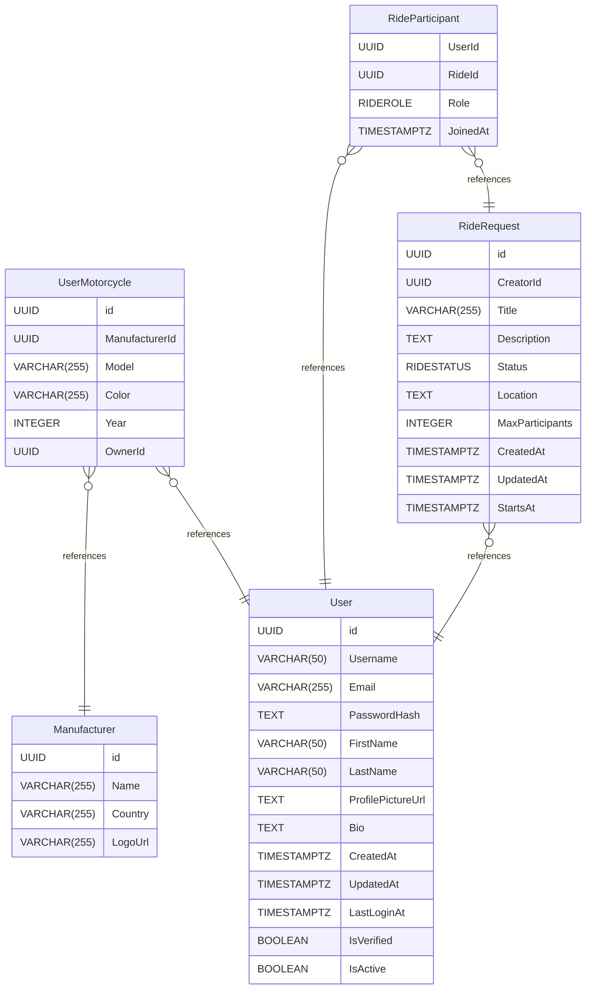

# Untitled Diagram documentation
## Summary

- [Introduction](#introduction)
- [Database Type](#database-type)
- [Table Structure](#table-structure)
	- [User](#user)
	- [UserMotorcycle](#usermotorcycle)
	- [Manufacturer](#manufacturer)
	- [RideRequest](#riderequest)
	- [RideParticipant](#rideparticipant)
- [Relationships](#relationships)
- [Database Diagram](#database-diagram)

## Introduction

## Database type

- **Database system:** PostgreSQL
## Table structure

### User

| Name                  | Type         | Settings         | References | Note |
| --------------------- | ------------ | ---------------- | ---------- | ---- |
| **id**                | UUID         | 🔑 PK, not null  |            |      |
| **Username**          | VARCHAR(50)  | not null, unique |            |      |
| **Email**             | VARCHAR(255) | not null, unique |            |      |
| **PasswordHash**      | TEXT         | not null         |            |      |
| **FirstName**         | VARCHAR(50)  | not null         |            |      |
| **LastName**          | VARCHAR(50)  | not null         |            |      |
| **ProfilePictureUrl** | TEXT         | null             |            |      |
| **Bio**               | TEXT         | null             |            |      |
| **CreatedAt**         | TIMESTAMPTZ  | not null         |            |      |
| **UpdatedAt**         | TIMESTAMPTZ  | not null         |            |      |
| **LastLoginAt**       | TIMESTAMPTZ  | null             |            |      |
| **IsVerified**        | BOOLEAN      | not null         |            |      |
| **IsActive**          | BOOLEAN      | not null         |            |      | 

### UserMotorcycle

| Name               | Type         | Settings        | References                                | Note |
| ------------------ | ------------ | --------------- | ----------------------------------------- | ---- |
| **id**             | UUID         | 🔑 PK, not null |                                           |      |
| **ManufacturerId** | UUID         | not null        | fk_Motorcycle_ManufacturerId_Manufacturer |      |
| **Model**          | VARCHAR(255) | not null        |                                           |      |
| **Color**          | VARCHAR(255) | null            |                                           |      |
| **Year**           | INTEGER      | not null        |                                           |      |
| **OwnerId**        | UUID         | not null        | fk_Motorcycle_OwnerId_User                |      | 

### Manufacturer

| Name        | Type         | Settings        | References | Note |
| ----------- | ------------ | --------------- | ---------- | ---- |
| **id**      | UUID         | 🔑 PK, not null |            |      |
| **Name**    | VARCHAR(255) | not null        |            |      |
| **Country** | VARCHAR(255) | not null        |            |      |
| **LogoUrl** | VARCHAR(255) | null            |            |      | 

### RideRequest

| Name                | Type         | Settings        | References                    | Note |
| ------------------- | ------------ | --------------- | ----------------------------- | ---- |
| **id**              | UUID         | 🔑 PK, not null |                               |      |
| **CreatorId**       | UUID         | not null        | fk_RideRequest_CreatorId_User |      |
| **Title**           | VARCHAR(255) | not null        |                               |      |
| **Description**     | TEXT         | null            |                               |      |
| **Status**          | RIDESTATUS   | not null        |                               |      |
| **Location**        | TEXT         | not null        |                               |      |
| **MaxParticipants** | INTEGER      | not null        |                               |      |
| **CreatedAt**       | TIMESTAMPTZ  | not null        |                               |      |
| **UpdatedAt**       | TIMESTAMPTZ  | not null        |                               |      |
| **StartsAt**        | TIMESTAMPTZ  | not null        |                               |      | 

### RideParticipant

| Name         | Type        | Settings        | References                            | Note |
| ------------ | ----------- | --------------- | ------------------------------------- | ---- |
| **UserId**   | UUID        | 🔑 PK, not null | fk_RideRequestParticipant_UserId_User |      |
| **RideId**   | UUID        | 🔑 PK, not null | fk_RideParticipant_RideId_Ride        |      |
| **Role**     | RIDEROLE    | not null        |                                       |      |
| **JoinedAt** | TIMESTAMPTZ | not null        |                                       |      | 

## Relationships

- **UserMotorcycle to Manufacturer**: many_to_one
- **UserMotorcycle to User**: many_to_one
- **RideRequest to User**: many_to_one
- **RideParticipant to User**: many_to_one
- **RideParticipant to RideRequest**: many_to_one

## Database Diagram

